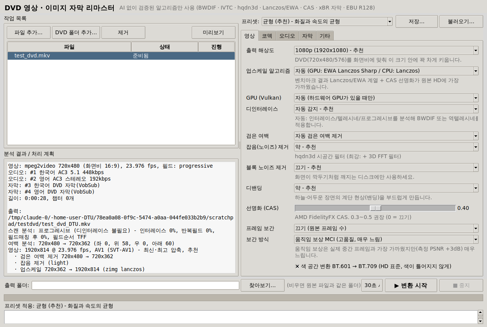
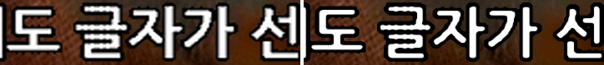
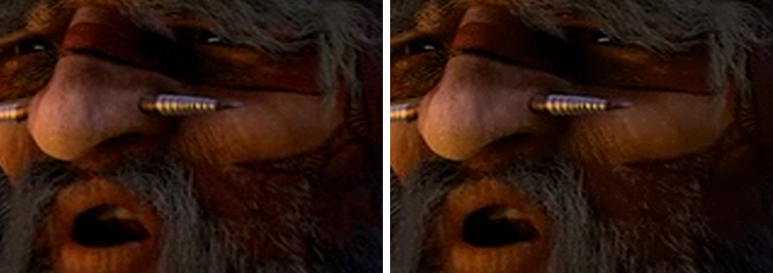

# DTU — DVD 영상 · 이미지 자막 리마스터

DVD에서 추출한 영화(VOB, MKV, VIDEO_TS 폴더, ISO)를 **AI(신경망) 없이**, 검증된 신호처리 알고리즘만으로 HD/4K로 리마스터합니다.

- 🎞 **영상**: 인터레이스·텔레시네 자동 판별 → 역텔레시네/디인터레이스 → 검은 여백 제거 → 잡음·블록 제거 → 업스케일(+BT.709 색 변환) → 디밴딩 → 선명화 → (선택) 프레임 보간
- 🔤 **이미지 자막**: DVD 자막(VobSub)을 출력 해상도에 맞춰 **다시 그린** 블루레이 PGS 자막으로 변환(켜고 끌 수 있음) 또는 영상에 입히기
- 🔊 **음질**: EBU R128 음량 정규화, 대사 강조, 야간 모드, 스테레오 다운믹스, 잡음·클릭 제거, 고음역 보강
- 📦 **최신 코덱**: AV1(SVT-AV1), HEVC(x265), H.264(x264), VVC/H.266(VVenC), NVIDIA·Intel·AMD·Apple 하드웨어 인코더
- 🖥 **간편한 앱**: 한국어 GUI, 프리셋, 전/후 미리보기, 30초 시험 변환, 일괄 변환 · 명령줄(CLI)도 지원

모든 기본값은 추측이 아니라 **직접 측정한 결과**로 정했습니다. 원본 HD 영상을 DVD 규격으로 열화시킨 뒤 각 알고리즘이 원본에 얼마나 가깝게 복원하는지 VMAF/PSNR/SSIM으로 비교했습니다 ([측정 결과](#알고리즘-선택-근거-벤치마크)).



| DVD 자막 — 일반 플레이어(왼쪽) vs DTU(오른쪽), 2배 확대 |
|---|
|  |

| 영상 — 일반 플레이어의 Bicubic 업스케일(왼쪽) vs DTU(오른쪽), 100% |
|---|
|  |

---

## 목차

1. [설치](#설치)
2. [사용법 (GUI)](#사용법-gui)
3. [사용법 (명령줄)](#사용법-명령줄)
4. [프리셋](#프리셋)
5. [처리 과정](#처리-과정)
6. [알고리즘 선택 근거 (벤치마크)](#알고리즘-선택-근거-벤치마크)
7. [이미지 자막 업스케일](#이미지-자막-업스케일)
8. [음질 개선](#음질-개선)
9. [코덱 선택 가이드](#코덱-선택-가이드)
10. [문제 해결 / FAQ](#문제-해결--faq)
11. [개발자용](#개발자용)

---

## 설치

필요한 것: **Python 3.9 이상**, **FFmpeg 6.1 이상**(7.1 이상의 "full" 빌드 권장), Python 패키지 `numpy`.

### Windows

1. Python 설치: <https://www.python.org/downloads/> — 설치 화면에서 **"Add python.exe to PATH"** 를 체크하세요.
2. FFmpeg 설치 (둘 중 하나):
   - 터미널(PowerShell)에서 `winget install Gyan.FFmpeg`
   - 또는 <https://www.gyan.dev/ffmpeg/builds/> 에서 `ffmpeg-release-full.7z` 를 받아 압축을 풀고, 앱의 **기타 → FFmpeg 폴더**에 `bin` 폴더를 지정
3. 이 저장소를 내려받아(Code → Download ZIP) 압축을 풀고 **`run_dtu.bat`** 을 더블클릭합니다. 처음 실행할 때 numpy가 자동 설치됩니다.

> Python 없이 실행 파일로 쓰고 싶다면, GitHub의 **Actions → Windows package → Run workflow** 를 실행하면 FFmpeg까지 포함된 `DTU-windows-x64.zip` 이 만들어집니다.

### macOS

```sh
brew install python-tk ffmpeg
./run_dtu.sh
```

### Linux (Ubuntu/Debian)

```sh
sudo apt install python3-tk python3-numpy ffmpeg   # 배포판 FFmpeg가 6.1 미만이면 BtbN 정적 빌드 사용
./run_dtu.sh
```

드래그 앤 드롭을 쓰려면 `pip install tkinterdnd2` (선택).

## 사용법 (GUI)

1. **파일 추가** 또는 **DVD 폴더 추가**를 누릅니다.
   - MakeMKV 등으로 만든 **MKV**, **VOB**(VTS_01_1.VOB를 고르면 VTS_01_2… 가 자동으로 이어 붙음), **VIDEO_TS 폴더**, **ISO**, MPG/TS/MP4 모두 가능
   - 같은 이름의 `.idx/.sub`(VobSub) 또는 `.sup` 자막 파일이 옆에 있으면 자동으로 함께 처리
2. 추가하면 바로 **자동 분석**이 진행됩니다: 인터레이스/텔레시네 판별, 검은 여백, 오디오·자막 트랙, 언어(IFO 포함).
3. 오른쪽에서 **프리셋**을 고르고 필요하면 탭(영상/코덱/오디오/자막)에서 세부 설정을 바꿉니다.
4. **미리보기**로 원하는 장면의 처리 전/후를 비교하고(100% 확대 가능), **30초 시험 변환**으로 화질과 예상 용량을 확인합니다.
5. **▶ 변환 시작**. 목록의 모든 파일이 차례대로 변환됩니다. 결과는 원본 옆(또는 지정한 출력 폴더)에 `이름_DTU.mkv` 로 저장됩니다.

## 사용법 (명령줄)

```sh
python -m dtu info  movie.mkv                         # 정보 + 인터레이스/여백 분석
python -m dtu caps                                    # FFmpeg 기능/사용 가능한 코덱/GPU 확인
python -m dtu encode movie.mkv --preset balanced      # 추천 설정으로 변환
python -m dtu encode VIDEO_TS --preset quality --codec hevc -o out.mkv
python -m dtu encode movie.mkv --sample 30            # 30초 시험 변환 (영상 1/3 지점)
python -m dtu encode *.vob --preset old_film --denoise very_strong --audio-denoise light
python -m dtu preview movie.mkv --time 600 -o cmp.png # 전/후 비교 이미지
python -m dtu subs movie.idx --size 1920x1080 -o movie.sup   # 자막만 업스케일 (.idx/.sub → .sup)
python -m dtu encode --help                           # 모든 옵션
```

## 프리셋

| 프리셋 | 영상 | 인코딩 | 오디오 | 용도 |
|---|---|---|---|---|
| 빠름 | 잡음 제거 약, CAS 0.3 | AV1 빠름 | 음량 정규화 | 빨리 결과가 필요할 때 |
| **균형 (추천)** | 잡음 제거 약, 디밴딩 약, CAS 0.4 | AV1 균형 | 음량 정규화 | 대부분의 영화 |
| 고품질 | 잡음 제거 중, 디밴딩 약, CAS 0.4 | AV1 느림(고효율) | 음량 정규화 | 소장용 |
| 오래된 영화 복원 | 잡음 제거 최강(+3D FFT), 블록 제거 약, 디밴딩 강 | AV1 + 필름 그레인 합성 | 잡음·클릭 제거 | 필름 입자·잡음이 많은 옛 영화 |
| 애니메이션 | 잡음 제거 중, 블록 제거 약, 디밴딩 강, CAS 0.5 | AV1 | 음량 정규화 | 셀 애니메이션 |
| 부드러운 움직임 | + 60fps 움직임 보상 보간 | AV1 | 음량 정규화 | 움직임이 많은 영상 (매우 느림) |
| 야간 시청 | 균형과 같음 | AV1 | 대사 강조 +4dB, 야간 모드, 대사 우선 스테레오 | TV 스피커·작은 음량 |
| 원본 보존 | 업스케일만 | AV1 | 원본 그대로 복사 | 손대지 않고 해상도만 |

프리셋은 코덱·컨테이너·트랙 선택 같은 "형식" 설정은 바꾸지 않습니다.

## 처리 과정

```
입력 (MKV · VOB 묶음 · VIDEO_TS · ISO · MPG)
 │
 ├─ 분석 ── idet + fieldmatch 2단계 판별 → 프로그레시브 / 소프트·하드 텔레시네 / 중복 프레임 / 인터레이스
 │          cropdetect 다지점 합집합 → 검은 여백, IFO → 자막 팔레트와 언어
 │
 ├─ 영상 ── [역텔레시네 fieldmatch+decimate | BWDIF | 소프트 풀다운 복원]
 │          → 크롭 → (블록 제거) → 잡음 제거 hqdn3d → (움직임 보상 보간 MCI)
 │          → 업스케일 + BT.601→BT.709 변환 (zimg Lanczos-3 / GPU libplacebo EWA Lanczos Sharp)
 │          → 디밴딩(고비트) → CAS 선명화 → 10비트 인코딩
 │
 ├─ 자막 ── VobSub 디코딩(자체 구현) → 자막마다 최적 알고리즘(윤곽 복원 / xBR)으로 다시 그리기
 │          → 256색 팔레트 양자화 → PGS(.sup) 작성(자체 구현) → MKV에 소프트 자막으로 (또는 영상에 입히기)
 │
 ├─ 오디오 ─ (클릭·클리핑·잡음 제거) → (대사 강조 / 다운믹스 / 야간 모드)
 │          → EBU R128 2패스 음량 측정 → 일정 게인 + 룩어헤드 리미터 → Opus / AAC / FLAC / AC3
 │
 └─ 출력 ── MKV(권장) 또는 MP4, 챕터·언어·메타데이터 유지
```

모든 "복원" 필터는 DVD 해상도(720×480/576)에서 실행됩니다. 결함이 실제로 있는 해상도에서 처리하는 편이 정확하고, 픽셀 수가 1080p의 1/6이라 훨씬 빠릅니다. 업스케일과 색 공간 변환은 zimg 한 번의 패스로 끝냅니다.

## 알고리즘 선택 근거 (벤치마크)

**방법**: Xiph 테스트 영상(1080p 원본: old_town_cross, park_joy, crowd_run, ducks_take_off, Sintel)을 DVD 규격으로 만들었습니다. 720×480 16:9 아나모픽, BT.601, MPEG-2 약 6 Mbps이고, 필름 입자를 추가한 것, 3:2 텔레시네한 것, 인터레이스한 것 등 여러 변형이 있습니다. 여기에 각 알고리즘을 적용한 결과를 **원래 HD 원본**과 비교했습니다. 재현 스크립트는 `tools/benchmark/` 에 있습니다.

### 업스케일 (5개 영상 평균, 원본 1080p 대비)

| 알고리즘 | VMAF | PSNR (dB) |
|---|---|---|
| Bilinear | 31.05 | 25.38 |
| Bicubic (Mitchell) | 32.49 | 25.42 |
| Bicubic (Catmull-Rom) | 36.91 | 25.48 |
| Spline36 (zimg) | 38.25 | 25.51 |
| **Lanczos-3 (zimg)** | **38.79** | 25.52 |
| Lanczos-3 + CAS 0.4 | 40.25 | 25.56 |

GPU(libplacebo)의 EWA Lanczos Sharp는 같은 3개 영상 기준으로 Lanczos-3와 VMAF 차이가 ±0.3 안쪽입니다. 대신 원형(EWA) 커널이라 대각선 계단 현상이 적어서, GPU가 있으면 이것을 씁니다. 선명화 강도는 아래와 같습니다.

| CAS 강도 | 0 | 0.2 | **0.4** | 0.6 | 0.8 | 1.0 |
|---|---|---|---|---|---|---|
| VMAF | 38.25 | 39.45 | 39.76 | 40.33 | 41.65 | 42.45 |
| PSNR | 25.514 | **25.568** | 25.565 | 25.555 | 25.503 | 20.488 |

VMAF는 선명화를 과하게 좋아하는 경향이 있습니다. 원본과의 실제 차이(PSNR)는 CAS 0.2~0.4에서 가장 좋아지고 1.0에서는 무너지기 때문에, 기본값은 0.4, 상한은 0.8로 정했습니다.

### 디인터레이스 (실제 50p/60p 원본 대비, 2배 프레임 출력)

| 알고리즘 | VMAF | PSNR (dB) |
|---|---|---|
| **BWDIF** | **75.67** | 25.73 |
| W3FDIF | 74.38 | 25.77 |
| EstDIF | 73.03 | 24.91 |
| Yadif | 69.75 | 24.78 |
| Bob(필드 확대) | 63.01 | 24.58 |

### 역텔레시네 (24p 원본 대비)

| 방법 | PSNR (dB) |
|---|---|
| **fps + fieldmatch + BWDIF(결합된 프레임만) + decimate** | **51.80** (원본 프레임 120/120 복원) |
| 디인터레이스 후 프레임 버리기 | 47.79 |
| pullup | 39.65 (118프레임) |
| 참고: 처음부터 프로그레시브로 인코딩한 DVD | 52.66 |

인터레이스/텔레시네 판별은 FFmpeg `idet`의 기본 민감도(1.04)가 필름 입자와 필드 단위 MPEG-2 압축 잡음을 "인터레이스"로 오판하는 것을 확인했습니다. 그래서 임계값을 1.5/2.0으로 보정한 2단계 판별을 사용합니다. 1단계는 원본 판별, 2단계는 필드 매칭 후 다시 판별해서, 텔레시네 필름은 0%로 떨어지고 진짜 인터레이스는 100%로 남습니다. 소프트 텔레시네(반복 필드 플래그)와 "프레임 복제 29.97p"도 판별해 원래 23.976p 프레임을 그대로 되살립니다(검증: 원본 240프레임 모두 동일하게 복원).

### 프레임 보간 (25p→50p로 만든 뒤, 새로 만든 프레임만 실제 중간 프레임과 비교)

| 방법 | crowd_run PSNR | old_town PSNR |
|---|---|---|
| 프레임 반복 | 22.09 | 29.86 |
| 프레임 혼합 (framerate) | 25.22 | 33.79 |
| **움직임 보상 MCI (minterpolate, EPZS)** | **28.52** | **36.53** |
| MCI + UMH 탐색 | 28.28 | 35.44 (2배 느림) |

### 잡음 제거 (필름 입자를 넣은 DVD, 깨끗한 원본 대비) · 블록 제거

| 필터 | VMAF | PSNR | SSIM | 속도 (SD) |
|---|---|---|---|---|
| 없음 | 33.53 | 24.071 | 0.8229 | — |
| **hqdn3d 약** | 33.44 | 24.083 | 0.8247 | **630 fps** |
| hqdn3d 기본 | 33.01 | 24.100 | 0.8265 | 630 fps |
| hqdn3d 강 | 32.13 | **24.105** | **0.8271** | 630 fps |
| NLMeans s=2 | 33.29 | 24.074 | 0.8229 | 3~10 fps |
| NLMeans s=4 | 31.88 | 24.036 | 0.8148 | 3 fps |
| BM3D (FFmpeg) | 33.52 | 24.075 | 0.8236 | 3 fps |
| FFT 3D (fftdnoiz) | 32.40 | 24.078 | 0.8253 | 25 fps |

시공간(3D) 필터인 hqdn3d가 PSNR과 SSIM을 가장 잘 개선하면서도 가장 빨랐습니다. 느린 NLMeans와 BM3D는 어떤 지표도 개선하지 못했습니다. 그래서 기본은 "약"이고, 필름 입자가 심한 영상에만 강하게 씁니다.

**블록 제거**는 일반 DVD 비트레이트에서 시험한 모든 필터가 원본과의 차이를 오히려 키웠습니다. `deblock`은 VMAF가 0.3~0.5 낮아졌고, 더 강한 spp·pp7은 설정에 따라 0.9~11.7 낮아졌습니다. 그래서 기본은 **끔**이고, 깍두기 현상이 눈에 띄는 디스크에만 가장 부드러운 `deblock`을 씁니다.

**디밴딩**은 수치로는 잡히지 않지만, 대비를 6배로 키워 보면 하늘 그라데이션의 MPEG-2 계단이 뚜렷하게 사라지고 경계선은 그대로 유지됩니다. 그래서 기본으로 "약"을 켭니다.

### 자막 업스케일 (벡터 폰트로 DVD 자막과 진짜 1080p 자막을 각각 그려 비교, 평균 절대 오차 — 낮을수록 좋음)

| 알고리즘 | 한글·3색 | 한글·AA 픽셀 | 영문·3색 | 영문·AA 픽셀 |
|---|---|---|---|---|
| 최근접 (원본 픽셀) | 24.96 | 25.31 | 21.27 | 21.93 |
| Lanczos | 21.92 | 19.12 | 19.43 | 17.34 |
| **xBR** | **19.95** | 20.62 | **15.80** | 16.93 |
| **윤곽 복원 (자체 알고리즘)** | 21.05 | **14.73** | 16.95 | **12.11** |

그래서 **자동** 모드는 자막마다 안티에일리어싱 픽셀이 있는지 검사합니다. 있으면 윤곽 복원을, 없으면 xBR을 씁니다.

### 코덱 (위 체인으로 만든 무손실 1080p 기준, "균형" 속도, 클립 3개 평균)

| 코덱 · 품질 | 비트레이트 | VMAF | 인코딩 시간 |
|---|---|---|---|
| **AV1 CRF 27 (기본)** | **8.1 Mbps** | 98.48 | 27초 |
| AV1 CRF 24 | 9.5 Mbps | 99.04 | 25초 |
| AV1 CRF 30 | 7.1 Mbps | 97.93 | 25초 |
| AV1 CRF 33 | 5.9 Mbps | 97.26 | 25초 |
| HEVC CRF 20 (기본) | 9.3 Mbps | 98.61 | 45초 |
| H.264 CRF 18 (기본) | 13.9 Mbps | 98.87 | 25초 |
| VVC QP 30 | 1.7 Mbps | 91.21 | 256초 |

같은 VMAF로 맞춰 비교하면 AV1 파일은 H.264보다 약 35%, HEVC보다 약 9% 작습니다. 인코딩도 HEVC보다 빨라서 기본 코덱은 AV1입니다. VVC는 AV1보다 10배쯤 느립니다.

## 이미지 자막 업스케일

DVD 자막은 720×480 해상도에 **4가지 색**(배경·글자·테두리·안티에일리어싱)만 쓰는 이미지입니다. 일반 플레이어는 이것을 영상과 함께 늘리기만 하므로, 1080p/4K TV에서는 글자가 계단지고 흐릿하게 보입니다.

DTU는 자막을 텍스트로 인식(OCR)하지 않고, **이미지 그대로 고해상도로 다시 그립니다**.

- **윤곽 복원**(자체 알고리즘): 자막을 테두리 → 글자처럼 겹친 **층**으로 해석합니다. 각 층의 경계를 B-스플라인으로 보간한 매끄러운 곡선으로 다시 만들고, 출력 1픽셀 폭으로 안티에일리어싱합니다(벡터 글꼴 확대에 쓰는 거리장 방식). 두 색의 중간색인 회색 픽셀은 "경계가 이 픽셀을 반쯤 지난다"는 정보로 해석하기 때문에, 원본 DVD보다도 경계가 또렷해집니다.
- **xBR**: 에뮬레이터에서 널리 쓰는 Hyllian의 픽셀아트 확대 알고리즘입니다. FFmpeg의 구현과 결과가 일치하도록 옮겼습니다(평균 차이 0.31/255).
- 결과는 256색 팔레트로 양자화해 **블루레이 PGS(.sup)** 로 저장합니다(FFmpeg에는 PGS 인코더가 없어 직접 구현). MKV 안에 켜고 끌 수 있는 자막으로 들어가며 mpv, VLC, MPC-HC, Kodi, Plex, Jellyfin, 대부분의 TV에서 재생됩니다.
- 검은 여백을 잘라내면서 여백 속에 있던 자막은 화면 안쪽의 안전 영역으로 옮깁니다.
- **강제 자막**(외국어 대사 등)은 플래그를 유지하고, 별도의 "강제 자막" 트랙도 만듭니다.
- 입력: MKV/VOB 내장 자막, `.idx/.sub`, VIDEO_TS(IFO 팔레트 자동 적용), 블루레이 `.sup`
- 자막만 변환할 수도 있습니다: `python -m dtu subs movie.idx --size 1920x1080`

## 음질 개선

모두 AI가 아닌 고전적인 신호처리이며, 필요한 것만 켜서 쓸 수 있습니다.

| 기능 | 알고리즘 | 설명 |
|---|---|---|
| 음량 정규화 (기본) | EBU R128 2패스 (`ebur128` 측정 → 일정 게인 → 룩어헤드 리미터 −1 dBFS) | 영화마다 제각각인 음량을 맞춥니다. 다이내믹 레인지는 그대로 두고 피크만 막습니다. 목표 −23 LUFS(방송 표준)이며 −16~−27 중에서 고를 수 있습니다. |
| 대사 강조 | 5.1: 센터 채널 게인 / 스테레오: `dialoguenhance`(음성 성분 추출) | 배경음에 묻히는 대사를 키웁니다. |
| 대사 우선 스테레오 | FC + 0.3×(L, Ls) 다운믹스 | TV 스피커로 5.1 영화를 볼 때 |
| 스테레오 다운믹스 | ITU-R BS.775 계수 | 표준 다운믹스 |
| 야간 모드 | `dynaudnorm` (다이내믹 오디오 노멀라이저) | 큰 소리는 줄이고 작은 소리는 키웁니다. |
| 잡음 제거 | `afftdn` (FFT 스펙트럼 차감 + 잡음 바닥 추적) | 옛 녹음의 히스 잡음 |
| 클릭/클리핑 복원 | `adeclick`, `adeclip` (자기회귀 보간) | LP·오래된 필름 사운드트랙 |
| 고음역 보강 | `aexciter` (하모닉 익사이터) | 손실 압축으로 사라진 고음의 "공기감" |

코덱은 Opus(기본: 5.1은 320kbps, 스테레오는 160kbps), AAC, FLAC(무손실), AC3/E-AC3(리시버 호환)이 있습니다. "원본 오디오 트랙도 함께 보존"을 켜면 원래 AC3/DTS 트랙도 그대로 남습니다.

## 코덱 선택 가이드

| 코덱 | 장점 | 주의 |
|---|---|---|
| **AV1 (SVT-AV1)** — 기본 | 가장 효율적인 범용 코덱, 10비트, 필름 그레인 합성 | 오래된 기기는 재생 불가(2020년 이후 TV·GPU·스마트폰은 대부분 지원) |
| HEVC (x265) | 폭넓은 하드웨어 재생, 10비트 | 인코딩이 AV1보다 느림 |
| H.264 (x264) | 거의 모든 기기에서 재생 | 8비트, 파일이 큼 |
| VVC/H.266 (VVenC) | 차세대 표준 | 재생 가능한 플레이어가 적고(최신 FFmpeg/mpv/VLC 4) 인코딩이 매우 느림 — 실험용 |
| NVENC / Quick Sync / AMF / VideoToolbox | 매우 빠름 | 같은 용량에서 소프트웨어 인코더보다 화질이 낮음. 설치된 GPU에서 실제로 동작하는지 시험 인코딩해서 목록에 표시 |

- **품질(CRF)**: 낮출수록 고화질이고 파일이 커집니다. 기본값(AV1 27 / HEVC 20 / H.264 18)은 무손실 업스케일 결과 대비 VMAF 약 98로, 눈으로는 차이가 거의 없는 수준입니다.
- **속도**: 느릴수록 같은 화질에서 파일이 작아집니다.
- 컨테이너는 **MKV**를 권장합니다. MP4에는 PGS 자막을 넣을 수 없어서 `.sup` 파일로 옆에 저장합니다.

## 문제 해결 / FAQ

- **암호화된 DVD(CSS)는요?** DTU에는 복호화 기능이 없습니다. 본인이 소유한 DVD를 합법적으로 백업한 파일(예: MakeMKV로 만든 MKV)을 사용하세요.
- **FFmpeg를 찾을 수 없다고 나옵니다.** 기타 탭에서 `ffmpeg.exe`가 있는 폴더를 지정하세요. `python -m dtu caps`로 기능을 확인할 수 있습니다.
- **너무 느립니다.** 속도를 "빠름"으로 바꾸거나, 하드웨어 인코더(NVENC 등)를 쓰거나, 프레임 보간을 끄세요. 움직임 보상 보간은 SD에서도 초당 3~4프레임이라 영화 한 편에 몇 시간이 걸립니다.
- **GPU 업스케일(EWA)이 쓰이지 않습니다.** Vulkan을 지원하는 GPU와 드라이버, libplacebo가 포함된 FFmpeg(gyan.dev full, BtbN)가 필요합니다. 소프트웨어 Vulkan(llvmpipe)은 CPU보다 느려서 자동 모드에서는 쓰지 않습니다.
- **VOB 파일만 있는데 자막 색이 이상합니다.** 자막 팔레트는 `VTS_xx_0.IFO`에 들어 있습니다. VOB와 같은 폴더에 IFO를 두거나 VIDEO_TS 폴더째로 추가하세요.
- **자막이 안 보입니다.** 플레이어에서 자막 트랙을 선택하세요(DVD 원본에 "기본" 표시가 있던 트랙만 자동으로 켜집니다). 항상 보이게 하려면 자막 탭에서 "영상에 입히기"를 고르세요.
- **변환을 중지하면?** 미완성 출력 파일은 자동으로 지웁니다.

## 개발자용

```sh
pip install -r requirements.txt pytest pillow
python -m pytest -q                       # 단위 테스트 + FFmpeg 통합 테스트(FFmpeg가 있을 때)
python tools/make_test_dvd.py SOURCE.mp4 out_dir   # 한글/영문 VobSub, AC3 5.1이 든 테스트 DVD 파일 생성
python tools/soft_pulldown.py in.m2v out.m2v       # 소프트 텔레시네(반복 필드 플래그) 테스트 영상 생성
```

벤치마크 재현(`tools/benchmark/`):

```sh
cd corpus && ../tools/benchmark/fetch.sh old_town_cross_1080p50 100 120   # Xiph 원본 일부 받기
bash ../tools/benchmark/make_corpus.sh                                     # DVD 규격으로 열화
python ../tools/benchmark/bench_upscale.py cpu      # 업스케일
python ../tools/benchmark/bench_filters.py denoise  # 잡음 제거 / sharpen / deblock / speed
python ../tools/benchmark/bench_deinterlace.py deint  # 디인터레이스 (ivtc: 역텔레시네)
python ../tools/benchmark/bench_interp.py           # 프레임 보간
python ../tools/benchmark/bench_codecs.py av1 hevc h264 vvc av1:30   # 코덱 효율 ("코덱:품질"로 품질 지정)
python ../tools/benchmark/bench_subtitles.py .      # 자막 업스케일 (Pillow + 한글 글꼴 필요)
```

구조:

```
dtu/
  analyze.py     인터레이스·텔레시네·중복 프레임 판별, 검은 여백 검출
  video.py       영상 필터 체인 구성
  audio.py       오디오 향상 체인, EBU R128 측정
  codecs.py      인코더 설정 (SW/HW)
  job.py         전체 변환 작업 (분석 → 자막 → 음량 측정 → 인코딩)
  inputs.py      VOB 묶음·VIDEO_TS·ISO·IFO(팔레트/언어)
  probe.py       ffprobe 정보
  preview.py     전/후 미리보기
  gui.py, cli.py
  subtitles/
    spu.py       DVD 자막(SPU) 디코더
    pgs.py       블루레이 PGS 인코더/디코더
    upscale.py   윤곽 복원 · xBR · Lanczos · 최근접
    quantize.py  팔레트 양자화 (median cut + k-means)
    source.py    FFmpeg 입력에서 자막 패킷 읽기
    pipeline.py  자막 트랙 → 업스케일 → .sup
```

## 라이선스

DTU 소스 코드는 MIT 라이선스입니다. FFmpeg와 인코더 라이브러리(x264, x265, SVT-AV1, VVenC 등)는 각자의 라이선스(대부분 GPL/LGPL/BSD)를 따릅니다. FFmpeg를 함께 배포할 때는 해당 라이선스를 지켜야 합니다.
